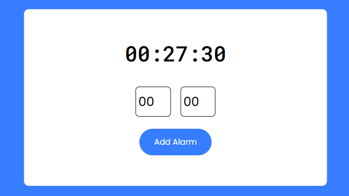
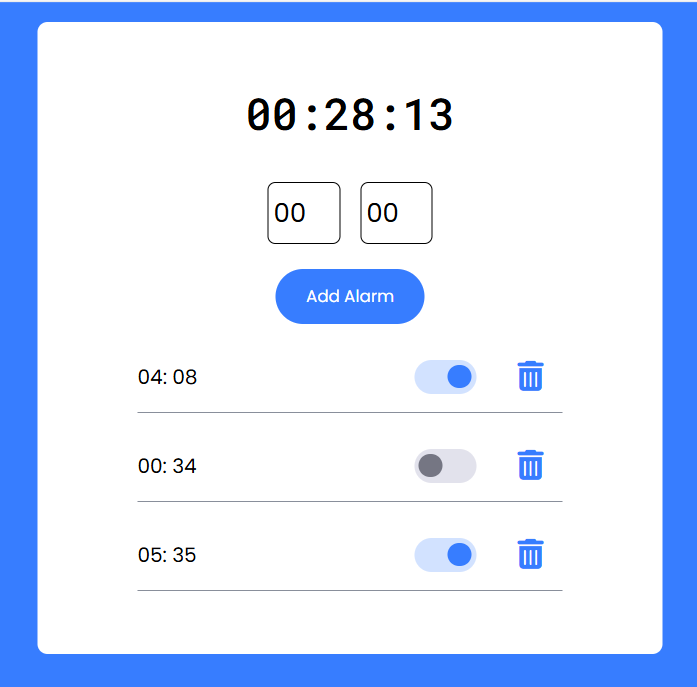

# ⏰ Multi Alarm Clock Web App
A responsive and minimalist alarm clock web application built with **HTML**, **CSS**, and **JavaScript**. This app allows users to set **multiple alarms**, toggle them on/off, and delete them as needed.

## 🚀 Features
- 🕒 Real-time clock display
- ⏰ Set multiple alarms
- ✅ Enable/disable each alarm
- 🗑️ Delete individual alarms
- 🔊 Custom alarm sound support
- 📱 Responsive design for all screen sizes

## 📸 Final Output

## 🛠️ Tech Stack
- **HTML5**
- **CSS3**
- **JavaScript (Vanilla)**
- Font Awesome (Icons)
- Google Fonts (Poppins, Roboto Mono)

## 🧑‍💻 Author
Sivanathan Dilakshan